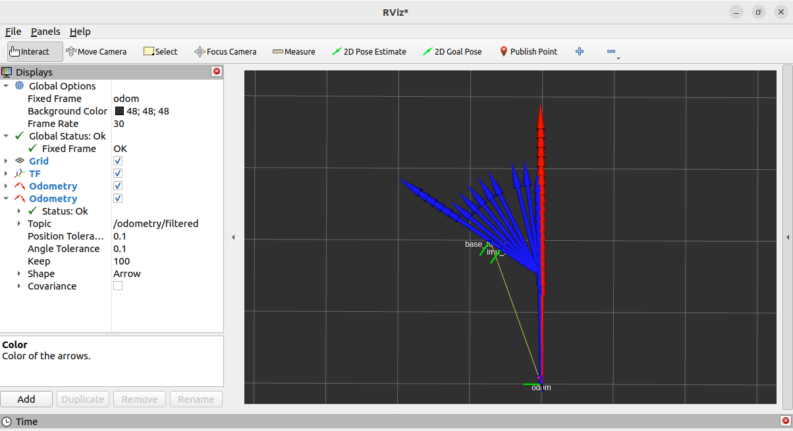

imu与里程计融合
===
轮式里程计可以通过监测轮子转动来估计机器人的位置和姿态变化，但容易受到滑动和不均匀地面等特殊情况的影响。IMU可以测量加速度和角速度，提供高频率的运动信息，但容易受到积分漂移和噪声的影响。将它们的数据融合可以弥补彼此的不足，提供更可靠和准确的定位结果，充分利用各自的优势，减少局限性。在ROS2中，提供了robot_localization功能包，可以方便的帮助开发人员实现二者的融合。

## Install & Dependence
- python
- pytorch
- numpy


## 1. robot_localization介绍
robot_localization是ROS2中的一个功能包，用于实现多传感器数据融合的机器人定位和导航。它提供了一个解决方案，可以将来自不同传感器（如轮式里程计、IMU、GPS、激光雷达等）的数据进行融合，以获得更准确和鲁棒的定位结果。在该功能包中，融合算法已经通过节点封装完毕，调用者只需在调用节点时注入参数即可。

请调用如下指令安装robot_localization：
```
sudo apt install ros-<distro>-robot-localization
```
## 2.robot_localization节点说明
在robot_localization功能包中提供了ekf_node、ukf_node和navsat_transform_node多个节点来实现机器人的状态估计和定位。不同节点介绍如下：
- ekf_node <a id="ekf_node"></a>
```
是基于增强卡尔曼滤波器（EKF）的节点，用于融合多个传感器数据来进行状态估计。它接收来自里程计、IMU、激光雷达等传感器的数据，并将它们融合在一起以提供更准确的机器人状态估计。EKF节点使用机器人的运动模型和传感器测量模型来估计机器人的位置、姿态和速度等状态变量。
```
- ukf_node
```
是基于无迹卡尔曼滤波器（UKF）的节点，用于实现机器人的状态估计和本地化。UKF节点采用无迹变换（Unscented Transform）来处理非线性系统，通过估计机器人在空间中的位置和姿态，提供更准确的状态估计。与EKF相比，UKF节点可以更好地处理非线性系统的估计问题。
```
- navsat_transform_node
```
用于将全球定位系统（GNSS）导航卫星数据与惯性测量单元（IMU）数据进行融合，以提供精确的位置估计。该节点校正GNSS信号的误差，并将其转化为带有高精度的位置信息。这有助于改善在室内或具有GNSS信号不稳定性的环境中的机器人定位精度。
```

这些节点是robot_localization功能包中的核心组件，每个节点都可以融合任意数量的传感器（惯性测量单元（IMU），里程计，室内定位系统，全球定位系统接收器等），它们支持 
 - nav_msgs/msg/Odometry（位置、方向和线性、角速度）

 - geometry_msgs/msg/PoseWithCovarianceStamped(位置和方向)

 - geometry_msgs/msg/TwistWithCovarianceStamped（线性和角速度）
 
 - sensor_msgs/msg/Imu（方向、角速度和线性加速度）消息，
 
 以跟踪机器人的15维（x、y、z、滚动、俯仰、偏航、x˙、y˙、z˙、滚动˙、俯仰˙、偏航˙、x¨、y¨、z¨）状态。

基于这些测量数据，状态估计节点将过滤后的位置、方向和线性、角速度（nav_msgs/Odometry）发布到 /odometry/filtered 话题上，并在启用时将过滤后的加速度发布到 /accel/filtered 话题上。

此外，它们可以（默认启用）将相应的变换作为 tf2 变换进行发布，无论是 odom → base_link 变换还是 map → odom 变换。

## 3.robot_localization使用示例
假设要融合轮式里程计与IMU，那么请先保证机器人底盘可以发布里程计消息以及IMU消息。在MyCar导航机器人中，Stm32底盘是满足条件的，但是Arduino底盘不包含IMU传感器，需要自行安装。融合时，可以使用ekf_node或ukf_node节点。本案例中使用的是stm32 4w底盘结合[ekf_node](#ekf_node)实现。其大致步骤如下：

- 1.编写luanch文件；
- 2.编写配置文件；
- 3.编译；
- 4.执行并查看结果。

由于robot_localization对融合实现已经做了很好的封装，所以整个实现流程是比较简单的。

### (1)编写launch文件
在ros2_stm32_bridge功能包的launch目录下新建文件driver_ekf.launch.py，并输入以下内容：
```
from launch import LaunchDescription
from ament_index_python.packages import get_package_share_directory
import launch_ros.actions
import os

def generate_launch_description():
    MYCAR_MODEL = os.environ['MYCAR_MODEL']
    return LaunchDescription([
        launch_ros.actions.Node(
            package='robot_localization',
            executable='ekf_node',
            name='ekf_filter_node',
            output='screen',
            parameters=[os.path.join(get_package_share_directory("ros2_stm32_bridge"), 'params', 'ekf.yaml')],
           ),
        launch_ros.actions.Node(
            package='tf2_ros',
            executable='static_transform_publisher',
            arguments=['--frame-id', 'base_footprint', '--child-frame-id', 'imu_link', '--x', '-0.15']
        ),
        launch_ros.actions.Node(
            package="ros2_stm32_bridge",
            executable="base_controller",
            parameters=[
                os.path.join(get_package_share_directory("ros2_stm32_bridge"), "params", MYCAR_MODEL + "_ekf.yaml"),],
        )
    ])
```
该launch文件中，启动了机器人底盘驱动，启动了robot_localization包中ekf_node节点，并且还发布了base_footprint与imu_link的坐标变换。

### (2)编写配置文件
- 2.1 在ros2_stm32_bridge功能包的params目录下新建文件stm32_4w_ekf.yaml，并输入以下内容:
```
/mini_driver:
# /**:
  ros__parameters:
    base_frame: base_footprint
    baud_rate: 115200
    control_rate: 10
    encoder_resolution: 44.0
    kd: 130
    ki: 0
    kp: 100
    maximum_encoding: 100.0
    model_param_acw: 0.45
    model_param_cw: 0.45
    odom_frame: odom
    port_name: /dev/mycar
    publish_tf: false
    qos_overrides:
      /parameter_events:
        publisher:
          depth: 1000
          durability: volatile
          history: keep_last
          reliability: reliable
      /tf:
        publisher:
          depth: 100
          durability: volatile
          history: keep_last
          reliability: reliable
    reduction_ratio: 90.0
    use_sim_time: false
    wheel_diameter: 0.080
```
在该文件中，一个重要操作是将publish_tf参数设置为false，设置为false后，底盘驱动不再发布base_footprint与odom的坐标变换，而是由ekf_node取而代之。
- 2.2 在ros2_stm32_bridge功能包的params目录下新建文件ekf.yaml，并输入以下内容：
```
### ekf config file ###
ekf_filter_node:
    ros__parameters:
# The frequency, in Hz, at which the filter will output a position estimate. Note that the filter will not begin
# computation until it receives at least one message from one of the inputs. It will then run continuously at the
# frequency specified here, regardless of whether it receives more measurements. Defaults to 30 if unspecified.
        frequency: 30.0

# The period, in seconds, after which we consider a sensor to have timed out. In this event, we carry out a predict
# cycle on the EKF without correcting it. This parameter can be thought of as the minimum frequency with which the
# filter will generate new output. Defaults to 1 / frequency if not specified.
        sensor_timeout: 0.1

# ekf_localization_node and ukf_localization_node both use a 3D omnidirectional motion model. If this parameter is
# set to true, no 3D information will be used in your state estimate. Use this if you are operating in a planar
# environment and want to ignore the effect of small variations in the ground plane that might otherwise be detected
# by, for example, an IMU. Defaults to false if unspecified.
        two_d_mode: false

# Use this parameter to provide an offset to the transform generated by ekf_localization_node. This can be used for
# future dating the transform, which is required for interaction with some other packages. Defaults to 0.0 if
# unspecified.
        transform_time_offset: 0.0

# Use this parameter to provide specify how long the tf listener should wait for a transform to become available. 
# Defaults to 0.0 if unspecified.
        transform_timeout: 0.0

# If you're having trouble, try setting this to true, and then echo the /diagnostics_agg topic to see if the node is
# unhappy with any settings or data.
        print_diagnostics: true

# Debug settings. Not for the faint of heart. Outputs a ludicrous amount of information to the file specified by
# debug_out_file. I hope you like matrices! Please note that setting this to true will have strongly deleterious
# effects on the performance of the node. Defaults to false if unspecified.
        debug: false

# Defaults to "robot_localization_debug.txt" if unspecified. Please specify the full path.
        debug_out_file: /path/to/debug/file.txt

# Whether we'll allow old measurements to cause a re-publication of the updated state
        permit_corrected_publication: false

# Whether to publish the acceleration state. Defaults to false if unspecified.
        publish_acceleration: false

# Whether to broadcast the transformation over the /tf topic. Defaults to true if unspecified.
        publish_tf: true

# REP-105 (http://www.ros.org/reps/rep-0105.html) specifies four principal coordinate frames: base_link, odom, map, and
# earth. base_link is the coordinate frame that is affixed to the robot. Both odom and map are world-fixed frames.
# The robot's position in the odom frame will drift over time, but is accurate in the short term and should be
# continuous. The odom frame is therefore the best frame for executing local motion plans. The map frame, like the odom
# frame, is a world-fixed coordinate frame, and while it contains the most globally accurate position estimate for your
# robot, it is subject to discrete jumps, e.g., due to the fusion of GPS data or a correction from a map-based
# localization node. The earth frame is used to relate multiple map frames by giving them a common reference frame.
# ekf_localization_node and ukf_localization_node are not concerned with the earth frame.
# Here is how to use the following settings:
# 1. Set the map_frame, odom_frame, and base_link frames to the appropriate frame names for your system.
#     1a. If your system does not have a map_frame, just remove it, and make sure "world_frame" is set to the value of
#         odom_frame.
# 2. If you are fusing continuous position data such as wheel encoder odometry, visual odometry, or IMU data, set
#   "world_frame" to your odom_frame value. This is the default behavior for robot_localization's state estimation nodes.
# 3. If you are fusing global absolute position data that is subject to discrete jumps (e.g., GPS or position updates
# from landmark observations) then:
#     3a. Set your "world_frame" to your map_frame value
#     3b. MAKE SURE something else is generating the odom->base_link transform. Note that this can even be another state
#         estimation node from robot_localization! However, that instance should *not* fuse the global data.
        map_frame: map              # Defaults to "map" if unspecified
        odom_frame: odom            # Defaults to "odom" if unspecified
        base_link_frame: base_footprint  # Defaults to "base_link" if unspecified
        world_frame: odom           # Defaults to the value of odom_frame if unspecified

# The filter accepts an arbitrary number of inputs from each input message type (nav_msgs/Odometry,
# geometry_msgs/PoseWithCovarianceStamped, geometry_msgs/TwistWithCovarianceStamped,
# sensor_msgs/Imu). To add an input, simply append the next number in the sequence to its "base" name, e.g., odom0,
# odom1, twist0, twist1, imu0, imu1, imu2, etc. The value should be the topic name. These parameters obviously have no
# default values, and must be specified.
        odom0: odom

# Each sensor reading updates some or all of the filter's state. These options give you greater control over which
# values from each measurement are fed to the filter. For example, if you have an odometry message as input, but only
# want to use its Z position value, then set the entire vector to false, except for the third entry. The order of the
# values is x, y, z, roll, pitch, yaw, vx, vy, vz, vroll, vpitch, vyaw, ax, ay, az. Note that not some message types
# do not provide some of the state variables estimated by the filter. For example, a TwistWithCovarianceStamped message
# has no pose information, so the first six values would be meaningless in that case. Each vector defaults to all false
# if unspecified, effectively making this parameter required for each sensor.
        odom0_config: [false,  false,  false,
                       false, false, false,
                       true, false, false,
                       false, false, false,
                       false, false, false]

# If you have high-frequency data or are running with a low frequency parameter value, then you may want to increase
# the size of the subscription queue so that more measurements are fused.
        odom0_queue_size: 2

# [ADVANCED] Large messages in ROS can exhibit strange behavior when they arrive at a high frequency. This is a result
# of Nagle's algorithm. This option tells the ROS subscriber to use the tcpNoDelay option, which disables Nagle's
# algorithm.
        odom0_nodelay: false

# [ADVANCED] When measuring one pose variable with two sensors, a situation can arise in which both sensors under-
# report their covariances. This can lead to the filter rapidly jumping back and forth between each measurement as they
# arrive. In these cases, it often makes sense to (a) correct the measurement covariances, or (b) if velocity is also
# measured by one of the sensors, let one sensor measure pose, and the other velocity. However, doing (a) or (b) isn't
# always feasible, and so we expose the differential parameter. When differential mode is enabled, all absolute pose
# data is converted to velocity data by differentiating the absolute pose measurements. These velocities are then
# integrated as usual. NOTE: this only applies to sensors that provide pose measurements; setting differential to true
# for twist measurements has no effect.
        odom0_differential: false

# [ADVANCED] When the node starts, if this parameter is true, then the first measurement is treated as a "zero point"
# for all future measurements. While you can achieve the same effect with the differential paremeter, the key
# difference is that the relative parameter doesn't cause the measurement to be converted to a velocity before
# integrating it. If you simply want your measurements to start at 0 for a given sensor, set this to true.
        odom0_relative: false

# [ADVANCED] If your data is subject to outliers, use these threshold settings, expressed as Mahalanobis distances, to
# control how far away from the current vehicle state a sensor measurement is permitted to be. Each defaults to
# numeric_limits<double>::max() if unspecified. It is strongly recommended that these parameters be removed if not
# required. Data is specified at the level of pose and twist variables, rather than for each variable in isolation.
# For messages that have both pose and twist data, the parameter specifies to which part of the message we are applying
# the thresholds.
        odom0_pose_rejection_threshold: 5.0
        odom0_twist_rejection_threshold: 1.0


        imu0: imu
        imu0_config: [false, false, false,
                      false, false,  true,
                      false, false, false,
                      false, false,  true,
                      false, false,  false]
        imu0_nodelay: false
        imu0_differential: false
        imu0_relative: true
        imu0_queue_size: 5
        imu0_pose_rejection_threshold: 0.8                 # Note the difference in parameter names
        imu0_twist_rejection_threshold: 0.8                #
        imu0_linear_acceleration_rejection_threshold: 0.8  #

# [ADVANCED] Some IMUs automatically remove acceleration due to gravity, and others don't. If yours doesn't, please set
# this to true, and *make sure* your data conforms to REP-103, specifically, that the data is in ENU frame.
        imu0_remove_gravitational_acceleration: true

# [ADVANCED]  The EKF and UKF models follow a standard predict/correct cycle. During prediction, if there is no
# acceleration reference, the velocity at time t+1 is simply predicted to be the same as the velocity at time t. During
# correction, this predicted value is fused with the measured value to produce the new velocity estimate. This can be
# problematic, as the final velocity will effectively be a weighted average of the old velocity and the new one. When
# this velocity is the integrated into a new pose, the result can be sluggish covergence. This effect is especially
# noticeable with LIDAR data during rotations. To get around it, users can try inflating the process_noise_covariance
# for the velocity variable in question, or decrease the  variance of the variable in question in the measurement
# itself. In addition, users can also take advantage of the control command being issued to the robot at the time we
# make the prediction. If control is used, it will get converted into an acceleration term, which will be used during
# predicition. Note that if an acceleration measurement for the variable in question is available from one of the
# inputs, the control term will be ignored.
# Whether or not we use the control input during predicition. Defaults to false.
        use_control: true
# Whether the input (assumed to be cmd_vel) is a geometry_msgs/Twist or geometry_msgs/TwistStamped message. Defaults to
# false.
        stamped_control: false
# The last issued control command will be used in prediction for this period. Defaults to 0.2.
        control_timeout: 0.2
# Which velocities are being controlled. Order is vx, vy, vz, vroll, vpitch, vyaw.
        control_config: [true, false, false, false, false, true]
# Places limits on how large the acceleration term will be. Should match your robot's kinematics.
        acceleration_limits: [1.3, 0.0, 0.0, 0.0, 0.0, 3.4]
# Acceleration and deceleration limits are not always the same for robots.
        deceleration_limits: [1.3, 0.0, 0.0, 0.0, 0.0, 4.5]
# If your robot cannot instantaneously reach its acceleration limit, the permitted change can be controlled with these
# gains
        acceleration_gains: [0.8, 0.0, 0.0, 0.0, 0.0, 0.9]
# If your robot cannot instantaneously reach its deceleration limit, the permitted change can be controlled with these
# gains
        deceleration_gains: [1.0, 0.0, 0.0, 0.0, 0.0, 1.0]
# [ADVANCED] The process noise covariance matrix can be difficult to tune, and can vary for each application, so it is
# exposed as a configuration parameter. This matrix represents the noise we add to the total error after each
# prediction step. The better the omnidirectional motion model matches your system, the smaller these values can be.
# However, if users find that a given variable is slow to converge, one approach is to increase the
# process_noise_covariance diagonal value for the variable in question, which will cause the filter's predicted error
# to be larger, which will cause the filter to trust the incoming measurement more during correction. The values are
# ordered as x, y, z, roll, pitch, yaw, vx, vy, vz, vroll, vpitch, vyaw, ax, ay, az. Defaults to the matrix below if
# unspecified.
        process_noise_covariance: [0.05, 0.0,    0.0,    0.0,    0.0,    0.0,    0.0,     0.0,     0.0,    0.0,    0.0,    0.0,    0.0,    0.0,    0.0,
                                   0.0,    0.05, 0.0,    0.0,    0.0,    0.0,    0.0,     0.0,     0.0,    0.0,    0.0,    0.0,    0.0,    0.0,    0.0,
                                   0.0,    0.0,    0.06, 0.0,    0.0,    0.0,    0.0,     0.0,     0.0,    0.0,    0.0,    0.0,    0.0,    0.0,    0.0,
                                   0.0,    0.0,    0.0,    0.03, 0.0,    0.0,    0.0,     0.0,     0.0,    0.0,    0.0,    0.0,    0.0,    0.0,    0.0,
                                   0.0,    0.0,    0.0,    0.0,    0.03, 0.0,    0.0,     0.0,     0.0,    0.0,    0.0,    0.0,    0.0,    0.0,    0.0,
                                   0.0,    0.0,    0.0,    0.0,    0.0,    0.06, 0.0,     0.0,     0.0,    0.0,    0.0,    0.0,    0.0,    0.0,    0.0,
                                   0.0,    0.0,    0.0,    0.0,    0.0,    0.0,    0.025, 0.0,     0.0,    0.0,    0.0,    0.0,    0.0,    0.0,    0.0,
                                   0.0,    0.0,    0.0,    0.0,    0.0,    0.0,    0.0,     0.025, 0.0,    0.0,    0.0,    0.0,    0.0,    0.0,    0.0,
                                   0.0,    0.0,    0.0,    0.0,    0.0,    0.0,    0.0,     0.0,     0.04, 0.0,    0.0,    0.0,    0.0,    0.0,    0.0,
                                   0.0,    0.0,    0.0,    0.0,    0.0,    0.0,    0.0,     0.0,     0.0,    0.01, 0.0,    0.0,    0.0,    0.0,    0.0,
                                   0.0,    0.0,    0.0,    0.0,    0.0,    0.0,    0.0,     0.0,     0.0,    0.0,    0.01, 0.0,    0.0,    0.0,    0.0,
                                   0.0,    0.0,    0.0,    0.0,    0.0,    0.0,    0.0,     0.0,     0.0,    0.0,    0.0,    0.02, 0.0,    0.0,    0.0,
                                   0.0,    0.0,    0.0,    0.0,    0.0,    0.0,    0.0,     0.0,     0.0,    0.0,    0.0,    0.0,    0.01, 0.0,    0.0,
                                   0.0,    0.0,    0.0,    0.0,    0.0,    0.0,    0.0,     0.0,     0.0,    0.0,    0.0,    0.0,    0.0,    0.01, 0.0,
                                   0.0,    0.0,    0.0,    0.0,    0.0,    0.0,    0.0,     0.0,     0.0,    0.0,    0.0,    0.0,    0.0,    0.0,    0.015]
# [ADVANCED] This represents the initial value for the state estimate error covariance matrix. Setting a diagonal
# value (variance) to a large value will result in rapid convergence for initial measurements of the variable in
# question. Users should take care not to use large values for variables that will not be measured directly. The values
# are ordered as x, y, z, roll, pitch, yaw, vx, vy, vz, vroll, vpitch, vyaw, ax, ay, az. Defaults to the matrix below
#if unspecified.
        initial_estimate_covariance: [1e-9, 0.0,    0.0,    0.0,    0.0,    0.0,    0.0,    0.0,    0.0,    0.0,     0.0,     0.0,     0.0,    0.0,    0.0,
                                      0.0,    1e-9, 0.0,    0.0,    0.0,    0.0,    0.0,    0.0,    0.0,    0.0,     0.0,     0.0,     0.0,    0.0,    0.0,
                                      0.0,    0.0,    1e-9, 0.0,    0.0,    0.0,    0.0,    0.0,    0.0,    0.0,     0.0,     0.0,     0.0,    0.0,    0.0,
                                      0.0,    0.0,    0.0,    1e-9, 0.0,    0.0,    0.0,    0.0,    0.0,    0.0,     0.0,     0.0,     0.0,    0.0,    0.0,
                                      0.0,    0.0,    0.0,    0.0,    1e-9, 0.0,    0.0,    0.0,    0.0,    0.0,     0.0,     0.0,     0.0,    0.0,    0.0,
                                      0.0,    0.0,    0.0,    0.0,    0.0,    1e-9, 0.0,    0.0,    0.0,    0.0,     0.0,     0.0,     0.0,    0.0,    0.0,
                                      0.0,    0.0,    0.0,    0.0,    0.0,    0.0,    1e-9, 0.0,    0.0,    0.0,     0.0,     0.0,     0.0,    0.0,    0.0,
                                      0.0,    0.0,    0.0,    0.0,    0.0,    0.0,    0.0,    1e-9, 0.0,    0.0,     0.0,     0.0,     0.0,    0.0,    0.0,
                                      0.0,    0.0,    0.0,    0.0,    0.0,    0.0,    0.0,    0.0,    1e-9, 0.0,     0.0,     0.0,     0.0,    0.0,    0.0,
                                      0.0,    0.0,    0.0,    0.0,    0.0,    0.0,    0.0,    0.0,    0.0,    1e-9,  0.0,     0.0,     0.0,    0.0,    0.0,
                                      0.0,    0.0,    0.0,    0.0,    0.0,    0.0,    0.0,    0.0,    0.0,    0.0,     1e-9,  0.0,     0.0,    0.0,    0.0,
                                      0.0,    0.0,    0.0,    0.0,    0.0,    0.0,    0.0,    0.0,    0.0,    0.0,     0.0,     1e-9,  0.0,    0.0,    0.0,
                                      0.0,    0.0,    0.0,    0.0,    0.0,    0.0,    0.0,    0.0,    0.0,    0.0,     0.0,     0.0,     1e-9, 0.0,    0.0,
                                      0.0,    0.0,    0.0,    0.0,    0.0,    0.0,    0.0,    0.0,    0.0,    0.0,     0.0,     0.0,     0.0,    1e-9, 0.0,
                                      0.0,    0.0,    0.0,    0.0,    0.0,    0.0,    0.0,    0.0,    0.0,    0.0,     0.0,     0.0,     0.0,    0.0,    1e-9]
```
在该文件中，关键配置如下：
```
......
        odom0_config: [false,  false,  false,
                       false, false, false,
                       true, false, false,
                       false, false, false,
                       false, false, false]

融合 x、y（2D）
        odom0_config: [true,  true,  false,
                        false, false, false,
                        true,  false, false,
                        false, false, false,
                        false, false, false]
......
        imu0_config: [false, false, false,
                      false, false,  true,
                      false, false, false,
                      false, false,  true,
                      false, false,  false]
```
上述配置主要是融合了里程计消息中的x方向速度与imu消息中的yaw角度生成新的里程计数据。
### (3)编译
```
colcon build --packages-select ros2_stm32_bridge
```

### (4)执行
```
ros2 launch ros2_stm32_bridge driver_ekf.launch.py
```
```
再启动rviz2以及键盘控制节点，在rviz2中将参考坐标系设置为odom，添加tf插件，再添加两个odometry插件并将话题分别设置为odom和odometry/filtered。使用键盘控制机器人前进，两个里程计插件显示的数据和机器人的实际运行基本相符，前进一段时间后，手动搬动机器人让其产生一定角度的偏航，该动作也能在融合后的里程计以及坐标变换中准确显示，而轮式里程计由于电机并未旋转而没有改变（如下图所示）。
```

