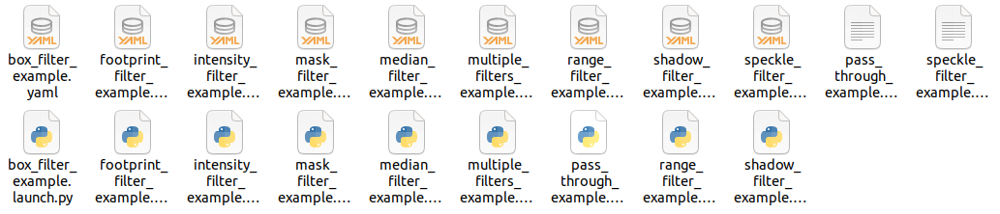

雷达过滤器
===
在机器人或自动驾驶车辆中，安装的雷达传感器通常会受到车身各个部分的遮挡影响。当车辆的外部结构、天线、摄像头等遮挡了雷达波束的一部分时，这些遮挡物会被雷达误认为是障碍物。这可能导致环境感知的准确性受到影响，并且可能会导致错误的障碍物检测和避障判断。那么如何过滤掉雷达消息中的遮挡物呢？在ROS2中，官方提供了laser_filters功能包，可用于解决上述问题。

## 1.功能包简介
laser_filters字面意思即为雷达过滤器，该包的主要内容是一些用于处理sensor_msgs/msg/LaserScan消息的通用过滤器。这些过滤器被导出为插件，调用者可以使用单个过滤器插件或将多个过滤器插件组合成过滤器链以处理雷达消息。通过laser_filters调用者可以剔除雷达消息中的无效信息，保留可用数据。

该功能包的安装指令如下：
```
sudo apt install ros-${ROS_DISTRO}-laser-filters
```

## 2.节点说明
laser_filters功能包中有一个较为常用的节点，名为scan_to_scan_filter_chain，其使用流程如下图所示：


接下来我们就订阅的话题、发布的话题、所需参数、使用示例以及内置插件等内容简单介绍一下该节点。

### 2.1 订阅的话题

/scan (sensor_msgs/msg/LaserScan)

- 订阅的雷达消息话题

### 2.2 发布的话题

/scan_filtered (sensor_msgs/msg/LaserScan)

- 发布的雷达消息话题

### 2.3 所需参数

- 过滤器名称
filterN.name

- 过滤器类型
filterN.type

- 过滤器参数
filterN.params

## 3. 使用示例
在功能包的安装目录下的examples

（具体路径：/opt/ros/${ROS_DISTRO}/share/laser_filters/examples）

已复制到当前工作空间 src/mycar/laser/laser融合launch文件预览
中已经给出了若干示例，以多过滤器使用为例，其对应的launch文件

[multiple_filters_example.launch.py](/src/mycar/laser/laser_filters_examples/multiple_filters_example.launch.py)

内容如下：
```
from launch import LaunchDescription
from launch.substitutions import PathJoinSubstitution
from launch_ros.actions import Node
from ament_index_python.packages import get_package_share_directory


def generate_launch_description():
    return LaunchDescription([
        Node(
            package="laser_filters",
            executable="scan_to_scan_filter_chain",
            parameters=[
                PathJoinSubstitution([
                    get_package_share_directory("laser_filters"),
                    "examples", "multiple_filters_example.yaml",
                ])],
        )
    ])
```
该文件中执行了功能包laser_filters下的scan_to_scan_filter_chain节点，并加载了用于配置过滤器的yaml文件。

该launch文件对应的配置文件[multiple_filters_example.yaml](/src/mycar/laser/laser_filters_examples/multiple_filters_example.yaml)内容如下：
```
scan_to_scan_filter_chain:
  ros__parameters:
    filter1:
      type: laser_filters/LaserArrayFilter
      name: laser_median_5
      params: 
        range_filter_chain:
          filter1:
            name: median_5
            type: filters/MultiChannelMedianFilterFloat 
            params:
              number_of_observations: 5
              unused: 10
        intensity_filter_chain:
          filter2:
            name: median_5
            type: filters/MultiChannelMedianFilterFloat 
            params:
              number_of_observations: 5
              unused: 10
    filter2: 
      name: intensity
      type: laser_filters/LaserScanIntensityFilter
      params:
        lower_threshold: 8000.
        upper_threshold: 100000.
        disp_histogram: 0
    filter3:
      name: shadows
      type: laser_filters/ScanShadowsFilter
      params:
        min_angle: 10.
        max_angle: 170.
        neighbors: 20
        window: 0
    filter4:
      name: dark_shadows
      type: laser_filters/LaserScanIntensityFilter
      params: 
        lower_threshold: 100.
        upper_threshold: 10000.
        disp_histogram: 0
```
在配置文件中，不同的过滤器依次使用filter1、filter2...的方式进行编号，过滤器下会通过name配置过滤器名称，type配置过滤器类型，params配置过滤器所需参数。

## 4. 插件说明
laser_filters提供了丰富的插件用于实现不同类型的雷达数据处理，主要插件有如下几种：
- LaserArrayFilter 对距离和强度进行过滤。

- LaserScanIntensityFilter 根据强度过滤sensor_msgs::msg::LaserScan数据。

- LaserScanRangeFilter 根据范围过滤sensor_msgs::msg::LaserScan信息。

- ScanShadowsFilter 过滤“拖尾”数据。

- InterpolationFilter 将扫描中出现的异常数据通过使用两侧的正常数据进行补齐。

- LaserScanAngularBoundsFilter 过滤激光扫描中超出某些角度范围的点。

- LaserScanAngularBoundsFilterInPlace 过滤激光扫描中某些角度范围内的点。

- LaserScanBoxFilter 去除激光扫描中在一个直角坐标盒内的点。

- LaserScanMaskFilter 过滤指定的激光雷达扫描点。

- LaserMedianFilter 中值过滤器（已废弃）。

- LaserScanFootprintFilter 过滤掉激光扫描中位于刻线半径内的点（已废弃）。

- LaserScanSpeckleFilter 过滤掉激光扫描中位于刻线半径内的点（已废弃）。


关于不同插件的具体使用，在功能包的安装目录下的examples中已经给出了对应示例。在我们实现雷达过滤功能时，可以参考这些示例。



